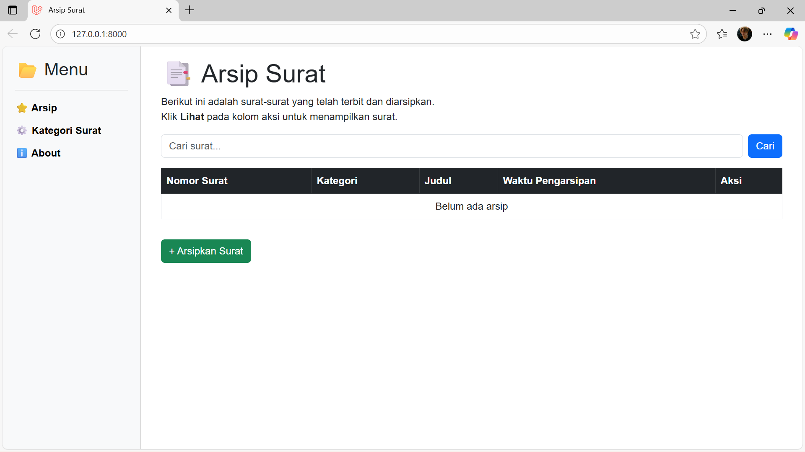
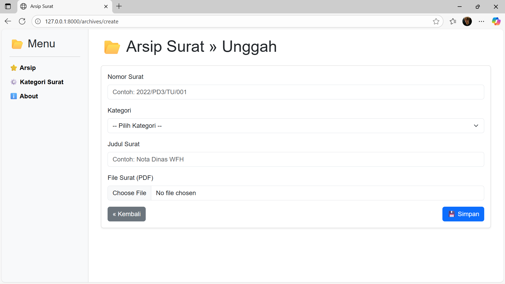
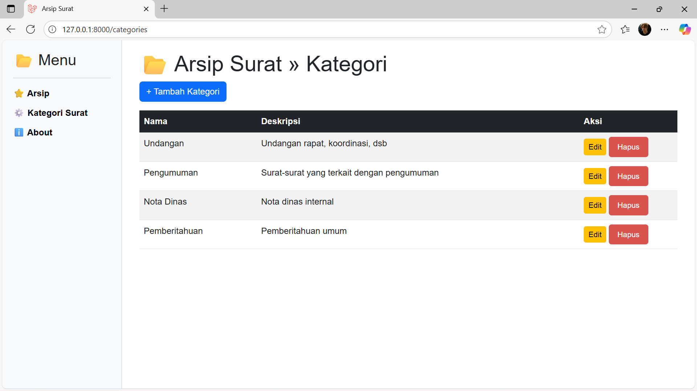
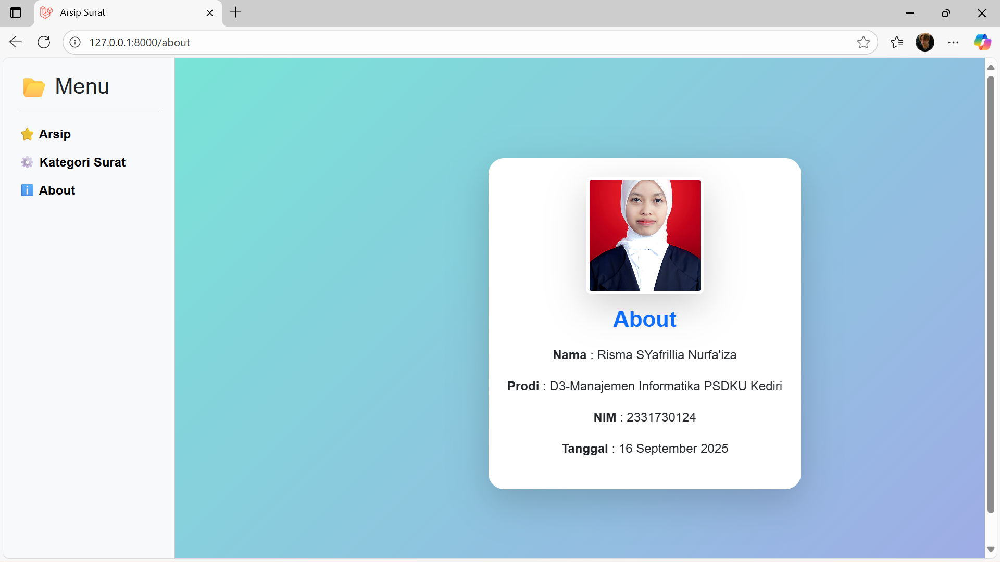

<p align="center">
    <a href="https://laravel.com" target="_blank">
        
    </a>
</p>

<h2 align="center">Sistem Informasi Arsip Surat</h2>

<p align="center">
    <a href="https://github.com/laravel/framework/actions"></a>
    <a href="https://packagist.org/packages/laravel/framework"></a>
    <a href="https://packagist.org/packages/laravel/framework"></a>
    <a href="https://packagist.org/packages/laravel/framework"></a>
</p>

---

## Tentang Project
Sistem Informasi Arsip Surat ini dibuat menggunakan **Laravel** untuk membantu desa/kelurahan dalam mengelola arsip surat masuk dan surat keluar. Aplikasi ini memudahkan pencatatan, penyimpanan, pencarian, serta pengelompokan surat dalam kategori tertentu sehingga lebih efisien, aman, dan terstruktur.

---

## Tujuan
- Menyediakan sistem pencatatan arsip surat digital.  
- Mempermudah pencarian arsip dengan fitur filter dan kategori.  
- Mengurangi risiko kehilangan dokumen.  
- Memastikan surat tersimpan dalam format standar (PDF).  

---

## Fitur Utama
- CRUD Surat Masuk & Surat Keluar  
- Upload & Simpan Surat (PDF)  
- Kategori Surat (Penting, Biasa, Rahasia, dll)  
- Pencarian Arsip & Pagination  
- Tampilan sederhana dan mudah digunakan  

---

## Cara Menjalankan
- Clone repository ini  
   ```bash
   **[git clone](https://github.com/rismasyafrillia/Arsip-Desa-Karangduren)
   cd arsip-surat
- Install dependencies
    composer install
    npm install && npm run dev
- Salin file .env.example menjadi .env lalu atur koneksi database.
- Generate key aplikasi
    php artisan key:generate
- Jalankan migrasi database
    php artisan migrate
- Jalankan server Laravel
    php artisan serve

## 🖼 Screenshot

### Daftar Arsip


### Form Tambah Surat


### Daftar Kategori


### Form Tambah Kategori


### About
